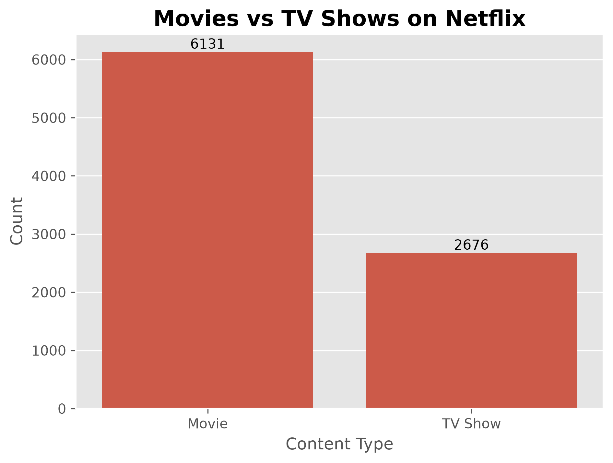
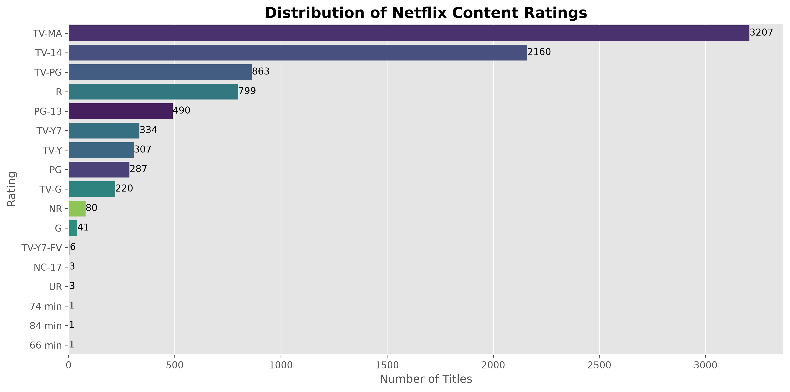
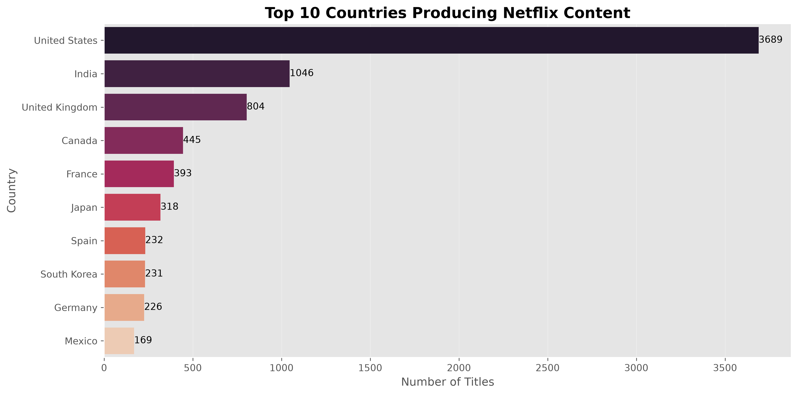
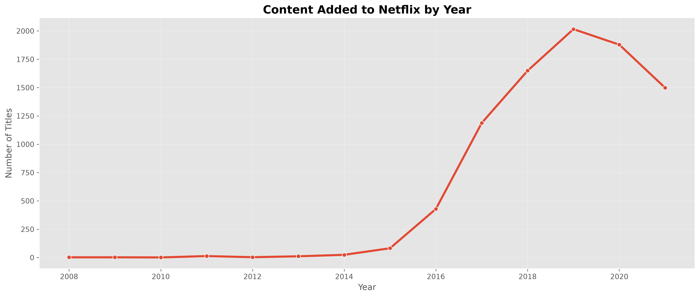
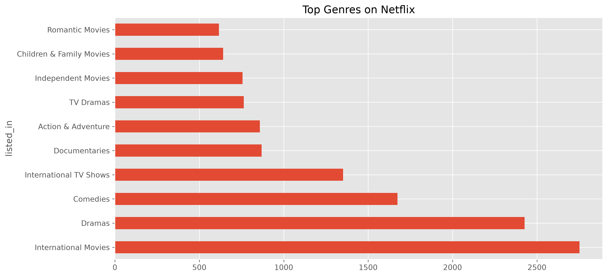

# 🎬 Netflix Data Analysis


---

## 📌 Project Overview

This project performs **Exploratory Data Analysis (EDA)** on the **Netflix Movies and TV Shows** dataset using Python.

The objective is to understand Netflix's content library by analyzing:

- Movies vs TV Shows
- Content Ratings
- Top Genres
- Top Producing Countries
- Year-wise Content Growth
- Missing Values
- Business Insights

---

## 🎯 Objectives

- Perform data cleaning
- Explore the dataset
- Create visualizations
- Generate business insights
- Practice Python for Data Analysis

---

## 🛠 Technologies Used

- Python
- Pandas
- NumPy
- Matplotlib
- Seaborn
- Jupyter Notebook

---

## 📂 Project Structure

```
netflix-data-analysis/
│
├── data/
│   └── netflix_titles.csv
│
├── notebooks/
│   └── netflix_eda.ipynb
│
├── images/
│
├── README.md
├── requirements.txt
├── LICENSE
└── .gitignore
```

---

## 📊 Visualizations

### Movies vs TV Shows



---

### Rating Distribution



---

### Top Countries



---

### Content Added by Year



---

### Top Genres



---

## 💡 Key Insights

- Netflix has significantly more Movies than TV Shows.
- International Movies dominate the platform.
- TV-MA is the most common content rating.
- The United States contributes the highest number of titles.
- Netflix experienced rapid content growth after 2015.

---

## 🚀 Future Improvements

- Interactive Dashboard using Plotly
- Power BI Dashboard
- Recommendation System
- Machine Learning Prediction Models
- Streamlit Web Application

---

## ▶️ How to Run

```bash
git clone https://github.com/jk1382k/netflix-data-analysis.git

cd netflix-data-analysis

pip install -r requirements.txt

jupyter notebook
```

---

## 👨‍💻 Author

**Jeevankumar**

- Former Senior Systems Engineer @ Infosys
- Data Science & AI Enthusiast
- Learning Data Science & Analytics with Artificial Intelligence at IT Vedant, Chennai

---

## ⭐ If you found this project useful, please consider giving it a star.